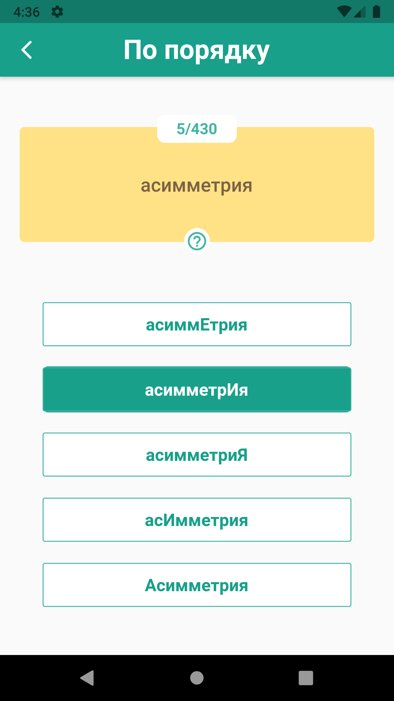
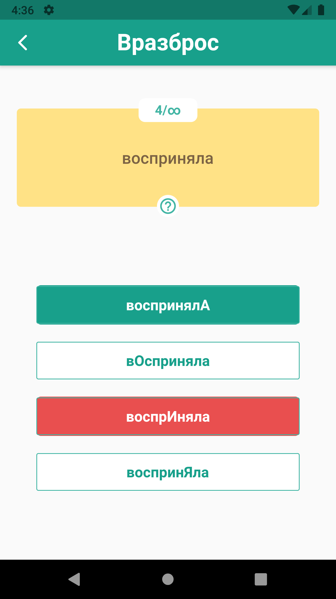
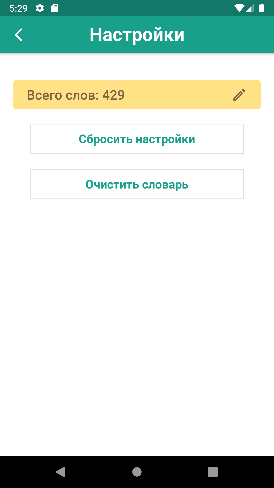
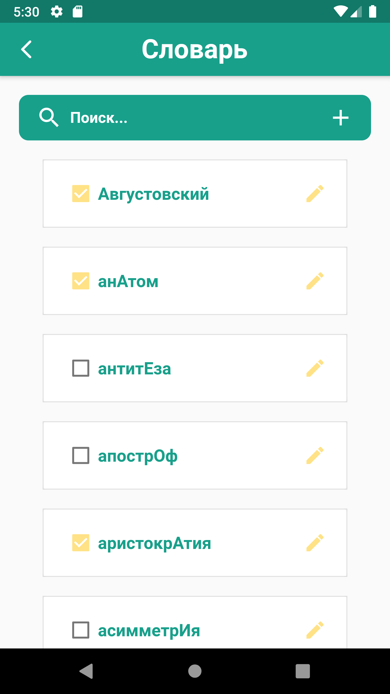
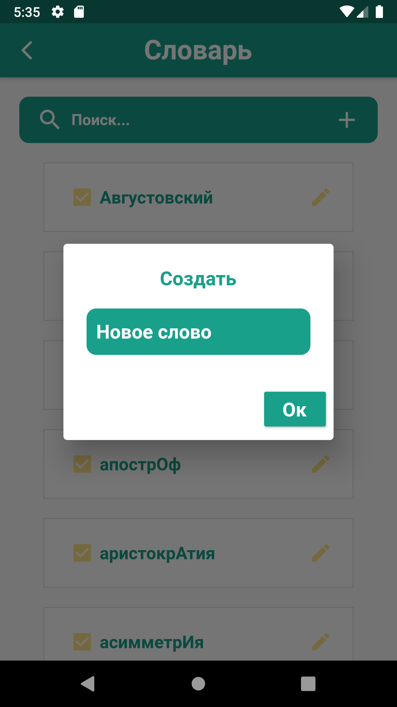

# Orthoepy

Приложения для тренировки ударения в русском языке, написанное на Flutter.
 
 
Скачать релизы <a href="https://github.com/bytes7bytes7/orthoepy_app/releases">здесь</a>.

# Screenshots

        
